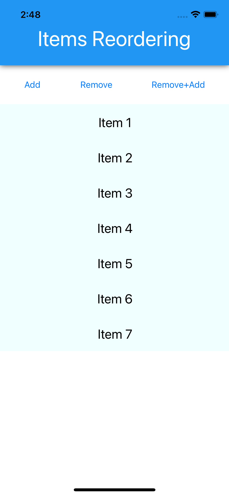
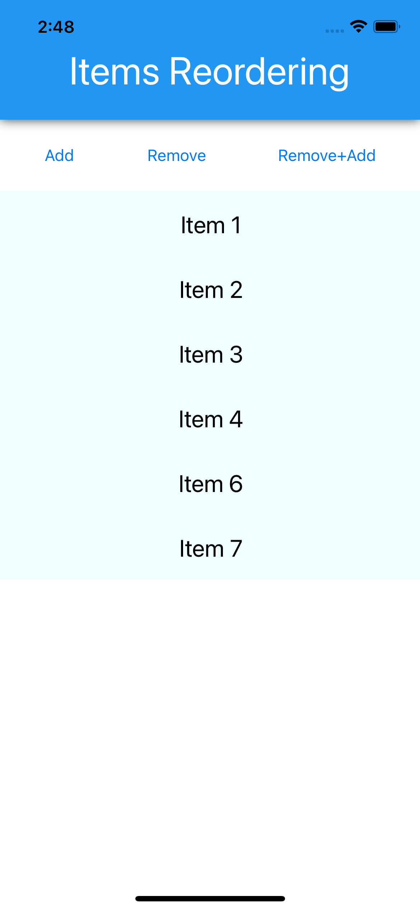

# CollectionView issue: Remove+Add = missing item

Steps:

1. Run the app and see all 7 items rendered
1. Hit "Remove+Add" button which removes item with index #4 and adds a new items in the index #0
1. Observe that the item with index #4 was removed but no new item was added

Alternatively, you can tap separate remove/add buttons before the remove animation is over to reproduce the issue. If you tap add button after remove animation is over, no issue is reproduced. Also, if you insert into any other than index #0, the issue is not reproduced.

[GitHub Issue](https://github.com)
